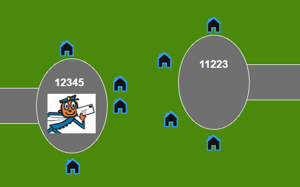
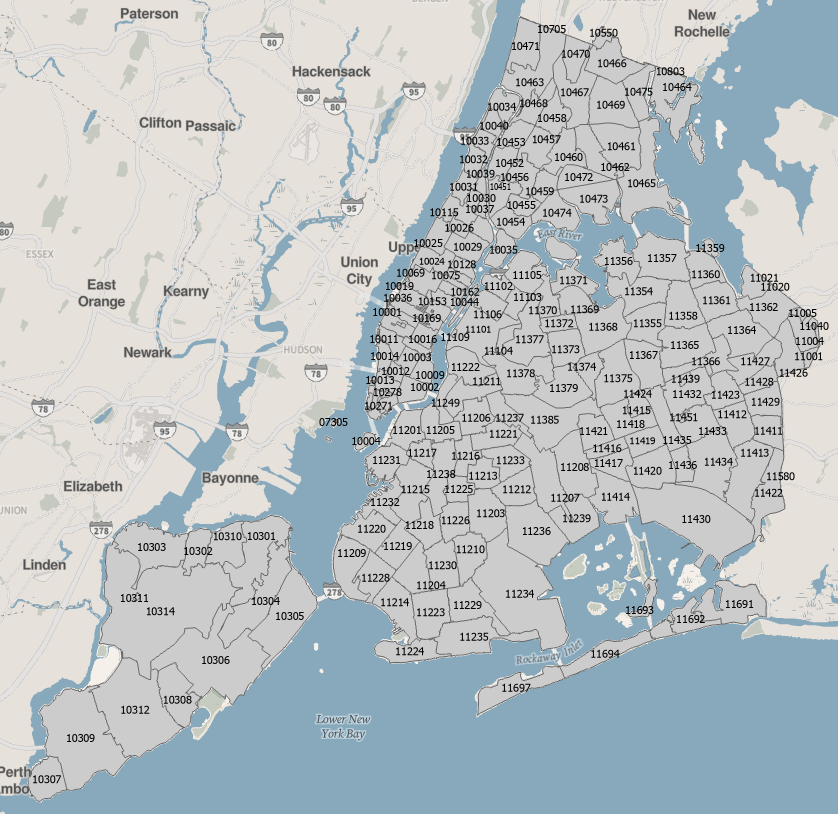

# ZIP Code Boundaries on NYC Open Data

"On matters of style, swim with the current. On matters of principle, stand like a rock" --Gucci Mane and Thomas Jefferson

## A Matter of Principle: ZIP Code Boundaries Do Not Exist

The United States Postal Service introduced the Zone Improvement Program (ZIP) in 1963 to improve mail delivery. A ZIP code is tied to delivery locations such as homes, buildings, and post office boxes. In other words, ZIP codes are made up of points where mail is delivered, not official lines on a map.

The Postal Service does not release official ZIP code boundaries. To understand why, imagine two nearby cul-de-sacs. Houses on the left use ZIP code 12345. Houses on the right use ZIP code 11223.

Where would the boundary go? Should it follow trees in the back yards? Should it follow a property line? Somewhere else? 

You know who doesn't need to decide where the ZIP code boundary is? The U.S. Postal Service. They deliver mail to addresses, not to crabgrass.

Still, many people who work with data need mapped areas for ZIP codes. Analysts, researchers, and data engineers often want ZIP code boundaries for mapping and statistics.

## A Matter Of Style: ZIP Code Tabulation Areas Are Trending With Users 

The United States Census Bureau publishes ZIP Code Tabulation Areas, or ZCTAs. ZCTAs are area-based approximations of ZIP codes. They are built from census blocks, which are small geographic areas used and published by the Census Bureau.

The Census Bureau starts with ZIP code point locations and assigns each census block to one ZIP code. Some blocks include addresses with more than one ZIP code. In those cases the block is assigned to the ZIP code used by the most addresses. See [this Census Bureau page](https://www.census.gov/programs-surveys/geography/guidance/geo-areas/zctas.html) for more details. 

ZCTAs are:

* useful for mapping and statistical analysis
* an official Census Bureau geography 
* updated every 10 years but otherwise stable

ZCTAS do not:

* include every valid ZIP code
* include water areas

## ZCTAs on NYC Open Data

People often look for ZIP code boundaries on NYC Open Data, but there is no official local ZIP code file to publish. To help meet that need, the Office of Technology and Innovation recently published a subset of the Census Bureau's 2020 ZCTAs.

https://data.cityofnewyork.us/City-Government/ZIP-Code-Tabulation-Areas/35j5-n34v/about_data

These ZCTAs have been clipped back to the New York City boundary. Some small edge ZCTAs are present where New York City addresses fall in ZCTAs more commonly associated with Westchester County or Nassau County. 

